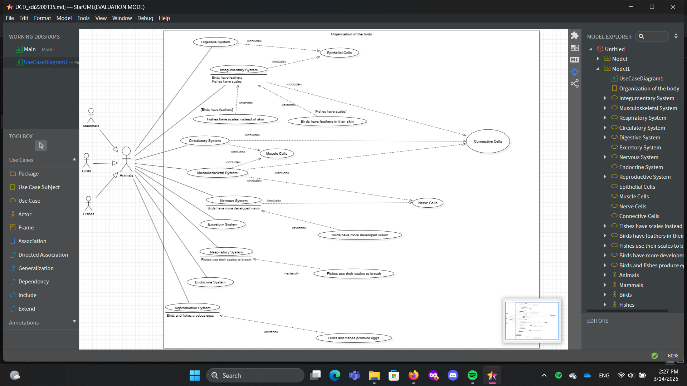

# micro-task 01
## 1. Introduction
* Based on the [decription](https://www.britannica.com/science/human-body), construct a **Use Case Diagram** that depicts the human body as organization. The actors that interact with the organization will be animals (mammals, birds, fish).
* If you cannot find all the answers you need in the description, you can make your own assumptions (see **chapter 4** below).

## 2. Goals
During this task, you have to accomplish (and check, accordingly) the following **goals**:
- [x] Depict system boundary.
- [x] Depict the basic use cases (not less than 3, not more than 10).
- [x] Depict actors.
- [x] Depict the relationships: associations, includes, extends, generalizations.

## 3. Guidelines
* You have to use only [starUML](https://staruml.io) to build the diagram.
* Upload in this folder of your repository the final **pdf** file, extracted from starUML. The filename format should be UCD_sdi0xxxxxx.pdf (where **sdi0xxxxxx** is your student id number).
* Upload in this folder  of your repository a printscreen from starUML and tag it in current README.md file (see example below).

## 4. Assumptions
* Assumption01: I chose the Organization of the body section.
* Assumption02: For the includes, I used the cell groups mentioned in the Organization of the body section and where we find them most frequently. 
* Assumption03: For the extends, I used operations that are different in fish and birds compared to mammals. 

## 5. Deadline
**Upload until**: 18-03-2025
