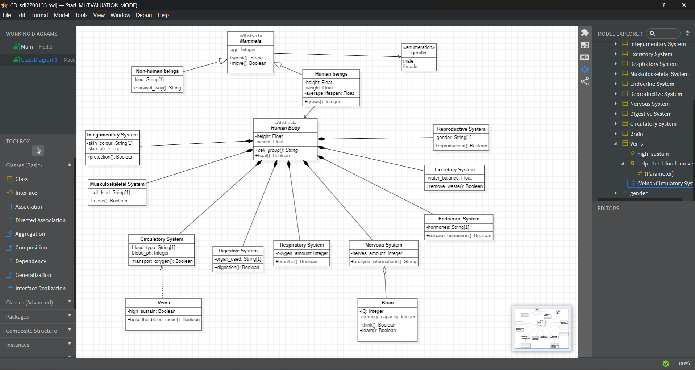

# micro-task 02
## 1. Introduction
* Based on the [decription](https://www.britannica.com/science/human-body), construct a **Class Diagram** (in folder **Sub02**) that depicts the human body as organization.
* If you cannot find all the answers you need in the description, you can make your own assumptions (see **chapter 4** below).

## 2. Goals
During this task, you have to accomplish (and check, accordingly) the following **goals**:
- [x] Depict human body as a class with at least 2 **attributes** and 2 **methods**.
- [x] Depict the basic systems of the human body as **classes** (not less than 3, not more than 10).
- [x] Depict at least one class as **Abstract** (whichever fits better to your design).
- [x] Depict the **relationships** between the classes (Aggregations and/or Compositions, Associations, Dependencies, Inheritance etc.) that better fit your diagram.
- [x] Depict at least one **enumeration**.
- [x] Depict at least one class attribute as **static** (whichever you want).

## 3. Guidelines
* You have to use only [starUML](https://staruml.io) to build the diagram.
* Upload in this folder of your repository the final **pdf** file, extracted from starUML. The filename format should be CD_sdi0xxxxxx.pdf (where **sdi0xxxxxx** is your student id number).
* Upload in this folder  of your repository a printscreen from starUML and tag it in current README.md file.

## 4. Assumptions
* Assumption01: In the Human Body I have as attributes high and weight and as operations cell_group(), which is used to determine the cell group of the system, and
                heal(), which is used to show whether a system can heal itself or not.
  
* Assumption02: As **Abstract** I have defined the Mammals class, with the abstract operation speak() because each mammal speaks in a different way, and the Human Body
                class, with the abstract operation cell_group() because each system of the organism has a different cell group.

* Assumption03: I use **Aggregation** between Brain and Nervous System, because the Brain as an organ can exist without the Nervous System when used for study and
                research in laboratories.

* Assumption04: I use **Composition** between the Human Body and all the individual Systems of the organization, because the Human Body has a strong dependence on them.

* Assumption05: I use **Directed Association** between Human beings and Human Body, and **Generalization** to separate mammals into Human beings and Non-human beings.

* Assumption06: I use **Dependency** between the Circulatory System and the Veins because they are essential for the proper functioning of the Circulatory System.

* Assumption07: I use **Enumeration** to determine that gender in Mammals can take 2 values: male or female.

* Assumption08: I have defined average_lifespan as **static** in the Human beings class, because it is a characteristic that is found at a specific time in the life of
                a large percentage of Human beings.

## 5. Deadline
**Upload until**: 01-04-2025
