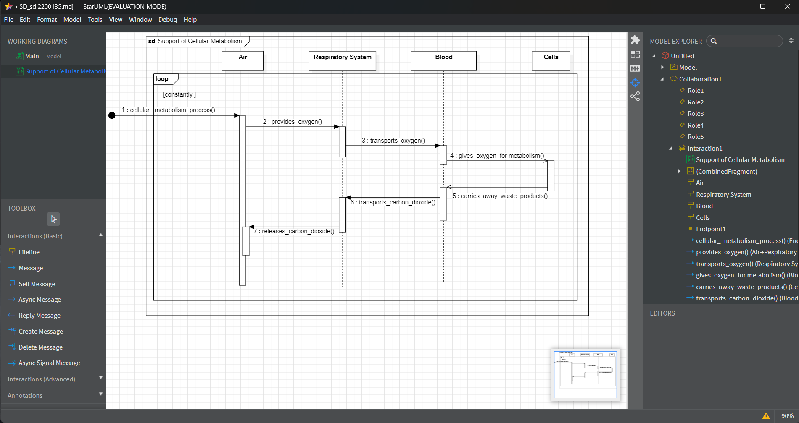

# micro-task 03
## 1. Introduction
* Based on the [description](https://www.britannica.com/science/human-body) below, construct a **Sequence Diagram** (in folder **Sub03**) that depicts all the interactions that take place during **breathing**.
* If you cannot find all the answers you need in the description, you can make your own assumptions (see **chapter 4** below).

> The respiratory system, composed of the breathing passages, lungs, and muscles of respiration, obtains from the air the oxygen necessary for cellular metabolism; it also returns to the air the carbon dioxide that forms as a waste product of such metabolism.
> 
> The circulatory system, composed of the heart, blood, and blood vessels, circulates a transport fluid throughout the body, providing the cells with a steady supply of oxygen and nutrients and carrying away waste products such as carbon dioxide and toxic nitrogen compounds.

## 2. Goals
During this task, you have to accomplish (and check, accordingly) at least the following **requirements**:
- [x] Depict at least 3 objects/lifelines in your diagram.
- [x] Depict all the necessary messages (at least 3 synchronous messages, at least 1 asynchronous message).
- [x] Depict at least one combined fragment (e.g. alternatives, options, loops).

## 3. Guidelines
* You have to use only [starUML](https://staruml.io) to build the diagram.
* Upload in this folder of your repository the final **pdf** file, extracted from starUML. The filename format should be SD_sdi0xxxxxx.pdf (where **sdi0xxxxxx** is your student id number).
* Upload in this folder  of your repository a printscreen from starUML and tag it in current README.md file.

## 4. Assumptions
* Assumption01: I use **asynchronous messaging** when oxygen is transported to the cells and when waste is removed from them, because I believe that these two tasks can
                be done simultaneously.
* Assumption02: I use **synchronous messaging** in all other cases.
* Assumption03: I use a **loop** to show that this process happens continuously.

## 5. Deadline
**Upload until**: 08-04-2025
