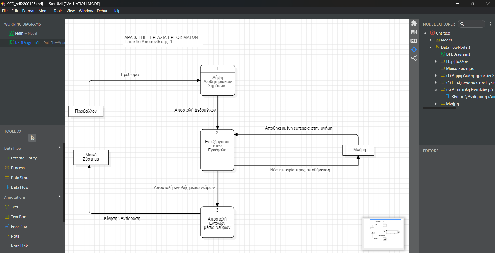

# micro-task 05
## 1. Introduction
* Based on the [description](https://www.britannica.com/science/human-body), select a subsystem of your choice and construct an 1-Level **Data Flow Diagram** in folder **Sub05**.
* If you cannot find all the answers you need in the description, you can make your own assumptions (see **chapter 4** below).

## 2. Goals
During this task, you have to accomplish (and check, accordingly) at least the following **requirements**:
- [x] Depict at least 3 processes in your diagram.
- [x] Depict at least 1 external entity in your diagram.
- [x] Depict at least 1 data store in your diagram.
- [x] Depict all the necessary flows.

## 3. Guidelines
* You have to use only [starUML](https://staruml.io) to build the diagram.
* Upload in this folder of your repository the final **pdf** file, extracted from starUML. The filename format should be SCD_sdi0xxxxxx.pdf (where **sdi0xxxxxx** is your student id number).
* Upload in this folder  of your repository a printscreen from starUML and tag it in current README.md file.

## 4. Assumptions
* Assumption01: I have chosen from the nervous system the process that is followed in case of irritation.
* Assumption02: **external entities**: Περιβάλλον, Μυϊκό Σύστημα
* Assumption03: **data store**: Μνήμη
* Assumption04: **processes**: Λήψη Αισθητηριακων Σημάτων, Επεξεργασία στον Εγκέφαλο, Αποστολή Εντολών μέσω Νεύρων
* Assumption04: The command transmitted through the nerves for movement or reaction is made through the muscular system and that is why there is this connection (Αποστολή Εντολών μέσω Νεύρων -> Μυϊκό Σύστημα).
                Then the muscular system takes over the process, which does not need to be depicted here, as I have chosen a function of the nervous system for analysis.

## 5. Deadline
**Upload until**: 11-05-2025
